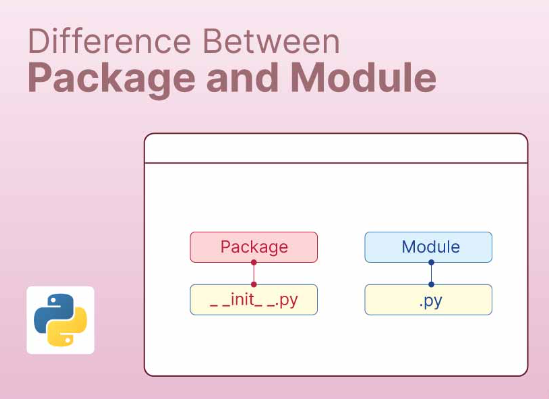
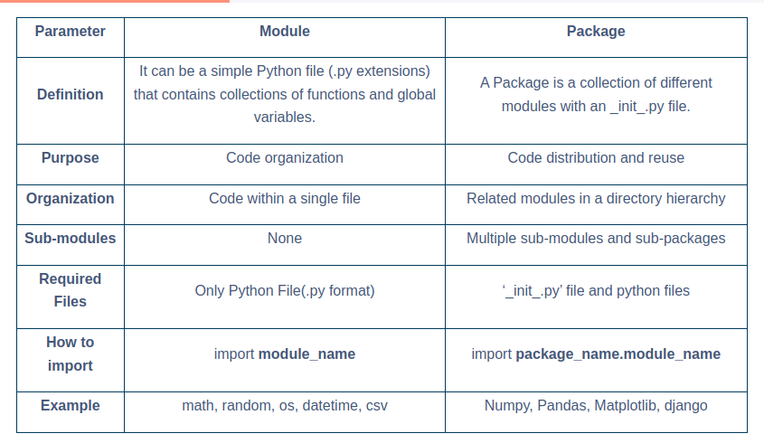

## Moudle

In Python, a module is a single file containing Python definitions and statements. These definitions and statements can include variables, functions, and classes and can be used to organize related functionality into a single, reusable package. Module organizes and reuses code in Python by grouping related code into a single file.

## Package

Python Packages are collections of modules that provide a set of related functionalities, and these modules are organized in a directory hierarchy. In simple terms, packages in Python are a way of organizing related modules in a single namespace.

Packages in Python are installed using a package manager like pip (a tool for installing and managing Python packages).
Each Python package must contain a file named _init_.py. 
_init_ file may be empty.
This file contains the initialization code for the corresponding package.
Some popular Python packages are: NumPy, Pandas, and Matplotlib.

# Difference Betweeen Module and Package

## Reference 
*https://www.shiksha.com/online-courses/articles/difference-between-module-and-package-in-python*